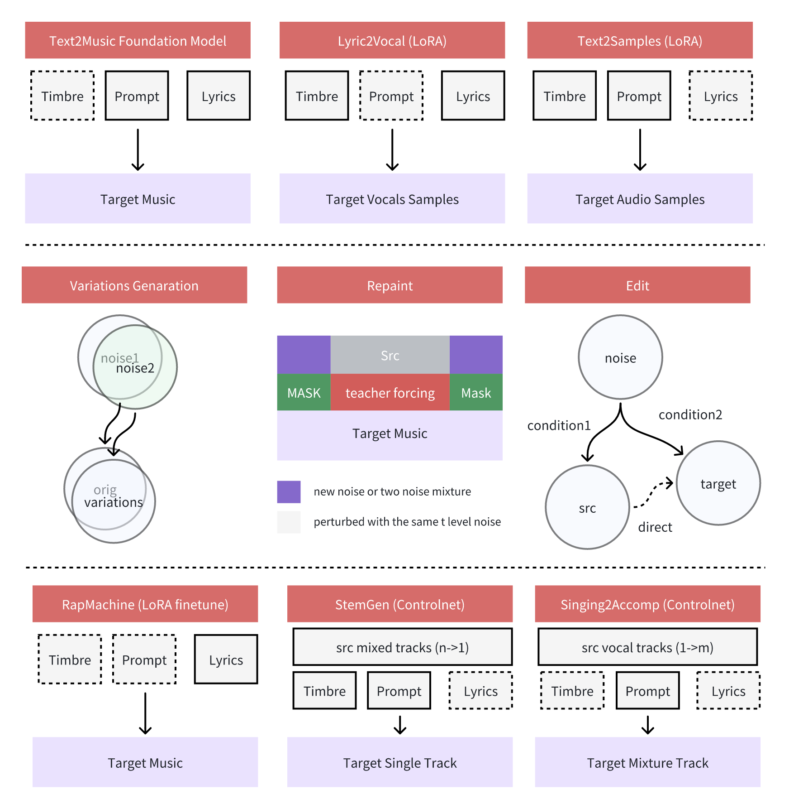
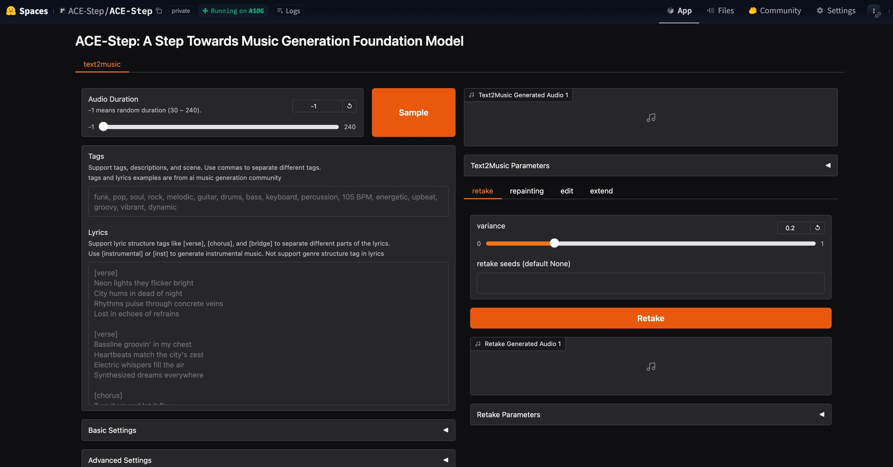
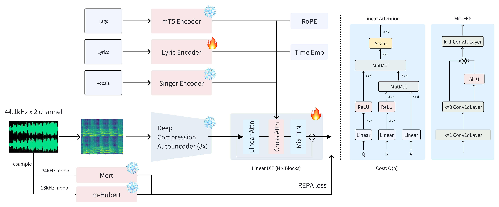

<h1 align="center">ACE-Step</h1>
<h1 align="center">A Step Towards Music Generation Foundation Model</h1>
<p align="center">
    <a href="https://ace-step.github.io/">Project</a> |
    <a href="https://huggingface.co/ACE-Step/ACE-Step-v1-3.5B">Hugging Face</a> |
    <a href="https://modelscope.cn/models/ACE-Step/ACE-Step-v1-3.5B">ModelScope</a> |
    <a href="https://huggingface.co/spaces/ACE-Step/ACE-Step">Space Demo</a> |
    <a href="https://discord.gg/PeWDxrkdj7">Discord</a> 
</p>
<p align="center">
  <a href="./README.md"></a>
  <a href="./README_CN.md"></a>
  <a href="./README_JA.md"></a>
</p>
---
<p align="center">
    
</p>

## Table of Contents

- [✨ Features](#-features)
- [📦 Installation](#-installation)
- [🚀 Usage](#-usage)
- [📱 User Interface Guide](#-user-interface-guide)
- [🔨 Train](#-train)

## 📝 Abstract

We introduce ACE-Step, a novel open-source foundation model for music generation that overcomes key limitations of existing approaches and achieves state-of-the-art performance through a holistic architectural design. Current methods face inherent trade-offs between generation speed, musical coherence, and controllability. For instance, LLM-based models (e.g., Yue, SongGen) excel at lyric alignment but suffer from slow inference and structural artifacts. Diffusion models (e.g., DiffRhythm), on the other hand, enable faster synthesis but often lack long-range structural coherence.

ACE-Step bridges this gap by integrating diffusion-based generation with Sana’s Deep Compression AutoEncoder (DCAE) and a lightweight linear transformer. It further leverages MERT and m-hubert to align semantic representations (REPA) during training, enabling rapid convergence. As a result, our model synthesizes up to 4 minutes of music in just 20 seconds on an A100 GPU—15× faster than LLM-based baselines—while achieving superior musical coherence and lyric alignment across melody, harmony, and rhythm metrics. Moreover, ACE-Step preserves fine-grained acoustic details, enabling advanced control mechanisms such as voice cloning, lyric editing, remixing, and track generation (e.g., lyric2vocal, singing2accompaniment).

Rather than building yet another end-to-end text-to-music pipeline, our vision is to establish a foundation model for music AI: a fast, general-purpose, efficient yet flexible architecture that makes it easy to train sub-tasks on top of it. This paves the way for developing powerful tools that seamlessly integrate into the creative workflows of music artists, producers, and content creators. In short, we aim to build the Stable Diffusion moment for music.


## 📢 News and Updates

- 🚀 **2025.05.08:** [ComfyUI_ACE-Step](https://t.co/GeRSTrIvn0) node is now available! Explore the power of ACE-Step within ComfyUI. 🎉


- 🚀 2025.05.06: Open source demo code and model


## ✨ Features

<p align="center">
    
</p>

### 🎯 Baseline Quality

#### 🌈 Diverse Styles & Genres

- 🎸 Supports all mainstream music styles with various description formats including short tags, descriptive text, or use-case scenarios
- 🎷 Capable of generating music across different genres with appropriate instrumentation and style

#### 🌍 Multiple Languages

- 🗣️ Supports 19 languages with top 10 well-performing languages including:
  - 🇺🇸 English, 🇨🇳 Chinese, 🇷🇺 Russian, 🇪🇸 Spanish, 🇯🇵 Japanese, 🇩🇪 German, 🇫🇷 French, 🇵🇹 Portuguese, 🇮🇹 Italian, 🇰🇷 Korean
- ⚠️ Due to data imbalance, less common languages may underperform

#### 🎻 Instrumental Styles

- 🎹 Supports various instrumental music generation across different genres and styles
- 🎺 Capable of producing realistic instrumental tracks with appropriate timbre and expression for each instrument
- 🎼 Can generate complex arrangements with multiple instruments while maintaining musical coherence

#### 🎤 Vocal Techniques

- 🎙️ Capable of rendering various vocal styles and techniques with good quality
- 🗣️ Supports different vocal expressions including various singing techniques and styles

### 🎛️ Controllability

#### 🔄 Variations Generation

- ⚙️ Implemented using training-free, inference-time optimization techniques
- 🌊 Flow-matching model generates initial noise, then uses trigFlow's noise formula to add additional Gaussian noise
- 🎚️ Adjustable mixing ratio between original initial noise and new Gaussian noise to control variation degree

#### 🎨 Repainting

- 🖌️ Implemented by adding noise to the target audio input and applying mask constraints during the ODE process
- 🔍 When input conditions change from the original generation, only specific aspects can be modified while preserving the rest
- 🔀 Can be combined with Variations Generation techniques to create localized variations in style, lyrics, or vocals

#### ✏️ Lyric Editing

- 💡 Innovatively applies flow-edit technology to enable localized lyric modifications while preserving melody, vocals, and accompaniment
- 🔄 Works with both generated content and uploaded audio, greatly enhancing creative possibilities
- ℹ️ Current limitation: can only modify small segments of lyrics at once to avoid distortion, but multiple edits can be applied sequentially

### 🚀 Applications

#### 🎤 Lyric2Vocal (LoRA)

- 🔊 Based on a LoRA fine-tuned on pure vocal data, allowing direct generation of vocal samples from lyrics
- 🛠️ Offers numerous practical applications such as vocal demos, guide tracks, songwriting assistance, and vocal arrangement experimentation
- ⏱️ Provides a quick way to test how lyrics might sound when sung, helping songwriters iterate faster

#### 📝 Text2Samples (LoRA)

- 🎛️ Similar to Lyric2Vocal, but fine-tuned on pure instrumental and sample data
- 🎵 Capable of generating conceptual music production samples from text descriptions
- 🧰 Useful for quickly creating instrument loops, sound effects, and musical elements for production

### 🔮 Coming Soon

#### 🎤 RapMachine

- 🔥 Fine-tuned on pure rap data to create an AI system specialized in rap generation
- 🏆 Expected capabilities include AI rap battles and narrative expression through rap
- 📚 Rap has exceptional storytelling and expressive capabilities, offering extraordinary application potential

#### 🎛️ StemGen

- 🎚️ A controlnet-lora trained on multi-track data to generate individual instrument stems
- 🎯 Takes a reference track and specified instrument (or instrument reference audio) as input
- 🎹 Outputs an instrument stem that complements the reference track, such as creating a piano accompaniment for a flute melody or adding jazz drums to a lead guitar

#### 🎤 Singing2Accompaniment

- 🔄 The reverse process of StemGen, generating a mixed master track from a single vocal track
- 🎵 Takes a vocal track and specified style as input to produce a complete vocal accompaniment
- 🎸 Creates full instrumental backing that complements the input vocals, making it easy to add professional-sounding accompaniment to any vocal recording


## 📋 Roadmap

- [x] Release training code 🔥
- [x] Release LoRA training code 🔥
- [ ] Release RapMachine LoRA 🎤
- [ ] Release ControlNet training code 🔥
- [ ] Release Singing2Accompaniment ControlNet 🎮
- [ ] Release evaluation performance and technical report 📄


## 🖥️ Hardware Performance

We have evaluated ACE-Step across different hardware setups, yielding the following throughput results:

| Device          | RTF (27 steps) | Time to render 1 min audio (27 steps) | RTF (60 steps) | Time to render 1 min audio (60 steps) |
| --------------- | -------------- | ------------------------------------- | -------------- | ------------------------------------- |
| NVIDIA RTX 4090 | 34.48 ×        | 1.74 s                                | 15.63 ×        | 3.84 s                                |
| NVIDIA A100     | 27.27 ×        | 2.20 s                                | 12.27 ×        | 4.89 s                                |
| NVIDIA RTX 3090 | 12.76 ×        | 4.70 s                                | 6.48 ×         | 9.26 s                                |
| MacBook M2 Max  | 2.27 ×         | 26.43 s                               | 1.03 ×         | 58.25 s                               |


We use RTF (Real-Time Factor) to measure the performance of ACE-Step. Higher values indicate faster generation speed. 27.27x means to generate 1 minute of music, it takes 2.2 seconds (60/27.27). The performance is measured on a single GPU with batch size 1 and 27 steps.


## 📦 Installation

### 1. Clone the Repository
First, clone the ACE-Step repository to your local machine and navigate into the project directory:
```bash
git clone https://github.com/ace-step/ACE-Step.git
cd ACE-Step
```

### 2. Prerequisites
Ensure you have the following installed:

* `Python`: Version 3.10 or later is recommended. You can download it from [python.org](https://www.python.org/).
* `Conda` or `venv`: For creating a virtual environment (Conda is recommended).

### 3. Set Up a Virtual Environment

It is highly recommended to use a virtual environment to manage project dependencies and avoid conflicts. Choose one of the following methods:

#### Option A: Using Conda

1.  **Create the environment** named `ace_step` with Python 3.10:
    ```bash
    conda create -n ace_step python=3.10 -y
    ```

2.  **Activate the environment:**
    ```bash
    conda activate ace_step
    ```

#### Option B: Using venv

1.  **Navigate to the cloned ACE-Step directory.**

2.  **Create the virtual environment** (commonly named `venv`):
    ```bash
    python -m venv venv 
    ```

3.  **Activate the environment:**
    * **On Windows (cmd.exe):**
        ```bash
        venv\Scripts\activate.bat
        ```
    * **On Windows (PowerShell):**
        ```powershell
        .\venv\Scripts\Activate.ps1 
        ```
        *(If you encounter execution policy errors, you might need to run `Set-ExecutionPolicy -ExecutionPolicy RemoteSigned -Scope Process` first)*
    * **On Linux / macOS (bash/zsh):**
        ```bash
        source venv/bin/activate
        ```

### 4. Install Dependencies
Once your virtual environment is activated:
**a.** (Windows Only) If you are on Windows and plan to use an NVIDIA GPU, install PyTorch with CUDA support first:

```bash
pip3 install torch torchvision torchaudio --index-url https://download.pytorch.org/whl/cu126
```
(Adjust cu126 if you have a different CUDA version. For other PyTorch installation options, refer to the [official PyTorch website](https://pytorch.org/get-started/locally/)).

**b.** Install ACE-Step and its core dependencies:
```bash
pip install -e .
```

The ACE-Step application is now installed. The GUI works on Windows, macOS, and Linux. For instructions on how to run it, please see the [Usage](#-usage) section.


## 🚀 Usage



### 🔍 Basic Usage

```bash
acestep --port 7865
```

### ⚙️ Advanced Usage

```bash
acestep --checkpoint_path /path/to/checkpoint --port 7865 --device_id 0 --share true --bf16 true
```

If you are using macOS, please use `--bf16 false` to avoid errors.

#### 🔍 API Usage
If you intend to integrate ACE-Step as a library into your own Python projects, you can install the latest version directly from GitHub using the following pip command.

**Direct Installation via pip:**

1.  **Ensure Git is installed:** This method requires Git to be installed on your system and accessible in your system's PATH.
2.  **Execute the installation command:**
    ```bash
    pip install git+https://github.com/ace-step/ACE-Step.git
    ```
    It's recommended to use this command within a virtual environment to avoid conflicts with other packages.

#### 🛠️ Command Line Arguments

- `--checkpoint_path`: Path to the model checkpoint (default: downloads automatically)
- `--server_name`: IP address or hostname for the Gradio server to bind to (default: '127.0.0.1'). Use '0.0.0.0' to make it accessible from other devices on the network.
- `--port`: Port to run the Gradio server on (default: 7865)
- `--device_id`: GPU device ID to use (default: 0)
- `--share`: Enable Gradio sharing link (default: False)
- `--bf16`: Use bfloat16 precision for faster inference (default: True)
- `--torch_compile`: Use `torch.compile()` to optimize the model, speeding up inference (default: False). **Not Supported on Windows**

## 📱 User Interface Guide

The ACE-Step interface provides several tabs for different music generation and editing tasks:

### 📝 Text2Music Tab

1. **📋 Input Fields**:
   - **🏷️ Tags**: Enter descriptive tags, genres, or scene descriptions separated by commas
   - **📜 Lyrics**: Enter lyrics with structure tags like [verse], [chorus], and [bridge]
   - **⏱️ Audio Duration**: Set the desired duration of the generated audio (-1 for random)

2. **⚙️ Settings**:
   - **🔧 Basic Settings**: Adjust inference steps, guidance scale, and seeds
   - **🔬 Advanced Settings**: Fine-tune scheduler type, CFG type, ERG settings, and more

3. **🚀 Generation**: Click "Generate" to create music based on your inputs

### 🔄 Retake Tab

- 🎲 Regenerate music with slight variations using different seeds
- 🎚️ Adjust variance to control how much the retake differs from the original

### 🎨 Repainting Tab

- 🖌️ Selectively regenerate specific sections of the music
- ⏱️ Specify start and end times for the section to repaint
- 🔍 Choose the source audio (text2music output, last repaint, or upload)

### ✏️ Edit Tab

- 🔄 Modify existing music by changing tags or lyrics
- 🎛️ Choose between "only_lyrics" mode (preserves melody) or "remix" mode (changes melody)
- 🎚️ Adjust edit parameters to control how much of the original is preserved

### 📏 Extend Tab

- ➕ Add music to the beginning or end of an existing piece
- 📐 Specify left and right extension lengths
- 🔍 Choose the source audio to extend

## 📂 Examples

The `examples/input_params` directory contains sample input parameters that can be used as references for generating music.

## 🏗️ Architecture

<p align="center">
    
</p>

## 🔨 Train

### Prerequisites
1. Prepare the environment as described in the installation section.

2. If you plan to train a LoRA model, install the PEFT library:
   ```bash
   pip install peft
   ```

3. Prepare your dataset in Huggingface format ([Huggingface Datasets documentation](https://huggingface.co/docs/datasets/index)). The dataset should contain the following fields:
   - `keys`: Unique identifier for each audio sample
   - `filename`: Path to the audio file
   - `tags`: List of descriptive tags (e.g., `["pop", "rock"]`)
   - `norm_lyrics`: Normalized lyrics text
   - Optional fields:
     - `speaker_emb_path`: Path to speaker embedding file (use empty string if not available)
     - `recaption`: Additional tag descriptions in various formats

Example dataset entry:
```json
{
	"keys": "1ce52937-cd1d-456f-967d-0f1072fcbb58",
	"filename": "data/audio/1ce52937-cd1d-456f-967d-0f1072fcbb58.wav",
	"tags": ["pop", "acoustic", "ballad", "romantic", "emotional"],
	"speaker_emb_path": "",
	"norm_lyrics": "I love you, I love you, I love you",
	"recaption": {
		"simplified": "pop",
		"expanded": "pop, acoustic, ballad, romantic, emotional",
		"descriptive": "The sound is soft and gentle, like a tender breeze on a quiet evening. It's soothing and full of longing.",
		"use_cases": "Suitable for background music in romantic films or during intimate moments.",
		"analysis": "pop, ballad, piano, guitar, slow tempo, romantic, emotional"
	}
}
```

### Training Parameters

#### Common Parameters
- `--dataset_path`: Path to your Huggingface dataset (required)
- `--checkpoint_dir`: Directory containing the base model checkpoint
- `--learning_rate`: Learning rate for training (default: 1e-4)
- `--max_steps`: Maximum number of training steps (default: 2000000)
- `--precision`: Training precision, e.g., "bf16-mixed" (default) or "fp32"
- `--devices`: Number of GPUs to use (default: 1)
- `--num_nodes`: Number of compute nodes to use (default: 1)
- `--accumulate_grad_batches`: Gradient accumulation steps (default: 1)
- `--num_workers`: Number of data loading workers (default: 8)
- `--every_n_train_steps`: Checkpoint saving frequency (default: 2000)
- `--every_plot_step`: Frequency of generating evaluation samples (default: 2000)
- `--exp_name`: Experiment name for logging (default: "text2music_train_test")
- `--logger_dir`: Directory for saving logs (default: "./exps/logs/")

#### Base Model Training
Train the base model with:
```bash
python trainer.py --dataset_path "path/to/your/dataset" --checkpoint_dir "path/to/base/checkpoint" --exp_name "your_experiment_name"
```

#### LoRA Training
For LoRA training, you need to provide a LoRA configuration file:
```bash
python trainer.py --dataset_path "path/to/your/dataset" --checkpoint_dir "path/to/base/checkpoint" --lora_config_path "path/to/lora_config.json" --exp_name "your_lora_experiment"
```

Example LoRA configuration file (lora_config.json):
```json
{
	"r": 16,
	"lora_alpha": 32,
	"target_modules": [
		"speaker_embedder",
		"linear_q",
		"linear_k",
		"linear_v",
		"to_q",
		"to_k",
		"to_v",
		"to_out.0"
	]
}
```

### Advanced Training Options
- `--shift`: Flow matching shift parameter (default: 3.0)
- `--gradient_clip_val`: Gradient clipping value (default: 0.5)
- `--gradient_clip_algorithm`: Gradient clipping algorithm (default: "norm")
- `--reload_dataloaders_every_n_epochs`: Frequency to reload dataloaders (default: 1)
- `--val_check_interval`: Validation check interval (default: None)


## 📜 License & Disclaimer

This project is licensed under [Apache License 2.0](./LICENSE)

ACE-Step enables original music generation across diverse genres, with applications in creative production, education, and entertainment. While designed to support positive and artistic use cases, we acknowledge potential risks such as unintentional copyright infringement due to stylistic similarity, inappropriate blending of cultural elements, and misuse for generating harmful content. To ensure responsible use, we encourage users to verify the originality of generated works, clearly disclose AI involvement, and obtain appropriate permissions when adapting protected styles or materials. By using ACE-Step, you agree to uphold these principles and respect artistic integrity, cultural diversity, and legal compliance. The authors are not responsible for any misuse of the model, including but not limited to copyright violations, cultural insensitivity, or the generation of harmful content.

🔔 Important Notice  
The only official website for the ACE-Step project is our GitHub Pages site.    
 We do not operate any other websites.  
🚫 Fake domains include but are not limited to:
ac\*\*p.com, a\*\*p.org, a\*\*\*c.org  
⚠️ Please be cautious. Do not visit, trust, or make payments on any of those sites.

## 🙏 Acknowledgements

This project is co-led by ACE Studio and StepFun.


## 📖 Citation

If you find this project useful for your research, please consider citing:

```BibTeX
@misc{gong2025acestep,
	title={ACE-Step: A Step Towards Music Generation Foundation Model},
	author={Junmin Gong, Wenxiao Zhao, Sen Wang, Shengyuan Xu, Jing Guo}, 
	howpublished={\url{https://github.com/ace-step/ACE-Step}},
	year={2025},
	note={GitHub repository}
}
```
